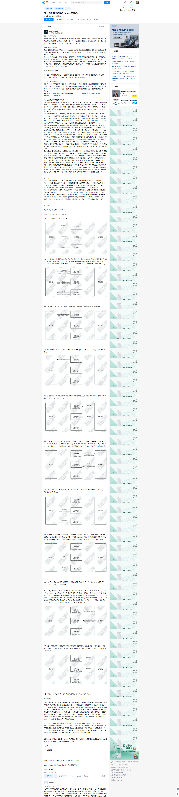
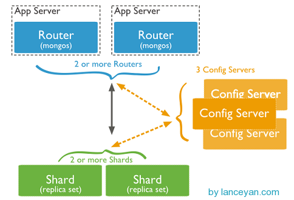

Document：[https://docs.mongodb.com/manual/core](https://docs.mongodb.com/manual/core)

**CRUD:**

create： db.collection.insertOne(dict)、db.collection.insertMany(dict)

read：db.collection.find(query, projection).limit(limit_num)

update：db.collection.updateOne(filter, action)、db.collection.updateMany(filter, action)

delete：db.collection.deleteOne、db.collection.deleteMany

bulk write：db.collection.bulkWrite，打包多个写入操作，分ordered和unordered两种，ordered-bulk write后面的write操作要等前面的write执行完毕才能开始，unordered-bulk write则并行写入，写入过程中遇到错误时，ordered-bulk write会中断执行，unordered-bulk write则会继续执行后面的write operations

**mongodb与mysql类比：** [https://docs.mongodb.com/manual/reference/sql-comparison/](https://docs.mongodb.com/manual/reference/sql-comparison/)

**索引：** db.collection.createIndex( { field_1: 1或-1, field_2: 1或-1 } )，1是asc, -1是desc, 字段必须是string或string数组类型

**文本检索text search：** 使用'text'索引和$text操作符，eg: 

    db.stores.insert(
   	[
     { _id: 1, name: "Java Hut", description: "Coffee and cakes", price:80, count:100 },
     { _id: 2, name: "Burger Buns", description: "Gourmet hamburgers", price:85, count:521 },
     { _id: 3, name: "Coffee Shop", description: "Just coffee", price:60, count:1000 },
     { _id: 4, name: "Clothes Clothes Clothes", description: "Discount clothing", price:55, count:5000 },
     { _id: 5, name: "Java Shopping", description: "Indonesian goods", price: 60, count:50}
   	])

	db.stores.createIndex({ name: "text", description: "text" })
	db.stores.find( { $text: { $search: "java coffee shop \"middle school\"" } } ) //该语句将查询name或description包含java、coffe、shop、middle school其中任何一个的记录,
	db.stores.find( { $text: { $search: "java shop -coffee" } } ) //该语句将查询name或description包含java或shop但不包含coffee的记录

text search默认不排序，可以使用$meta："textScore"按匹配相关度排序，eg：

	db.stores.find(
   		{ $text: { $search: "java coffee shop" } },
   		{ score: { $meta: "textScore" } }
	).sort( { score: { $meta: "textScore" } } )
	
	返回结果：
	{ _id: 1, name: "Java Hut", description: "Coffee and cakes", price:80, count:100, score: 2.6},
	{ _id: 3, name: "Coffee Shop", description: "Just coffee", price:60, count:1000, score: 1.8},
	{ _id: 5, name: "Java Shopping", description: "Indonesian goods", price: 60, count:50, score: 1.4}

**注意：** 视图不支持text search，一个collection只能有一个text index，但一个text index可以覆盖多个字段

**聚合管道中使用文本检索：**
	
	//$match 选择price大于70且小于90，或者count大于等于1000
	db.stores.aggregate( [
	  { $match: { $or: [ { price: { $gt: 70, $lt: 90 } }, { count: { $gte: 1000 } } ] } },
	  { $group: { _id: null, count: { $sum: 1 } } }
	] );
	返回结果：{ "_id" : null, "count" : 4 }
	
	//文本搜索coffee|cake，搜索结果只保留_id、price字段且相关度大于1.0的documents
	db.stores.aggregate(
	[
	     { $match: { $text: { $search: "coffee cake" } } },
	     { $project: { _id: 1, price: 1, score: { $meta: "textScore" } } },
	     { $match: { score: { $gt: 1.0 } } }
	])
	// 搜索语言为英文, 返回搜索结果的price和
	db.stores.aggregate(
  	[
    	{ $match: { $text: { $search: "coffee -cakes", $language: "es" } } },
     	{ $group: { total_price: { $sum: "$price" } } }
    ])

**地理位置查询：** 使用GeoJson数据结构， def:

	location: {
      type: "Point",
      coordinates: [-73.856077, 40.848447]
	}

其中type为GeoJson object type，包括Point、MultiPoint、LineString、MultiLineString、Polygon、MultiPolygon、GeometryCollection。参考[https://docs.mongodb.com/manual/reference/geojson/](https://docs.mongodb.com/manual/reference/geojson/)

Geospatial Indexes：
	// 创建索引
	db.collection.createIndex( { <location field> : "2dsphere" }) // 类似地球的经纬度索引
	db.collection.createIndex( { <location field> : "2d" }) // 平面空间索引

查询函数：

- $geoNear
- $near、$nearSphere (>= MongoDB 4.0)
- $geoWithin
- $geoIntersect

以上支持sharded collections

eg: 

	db.places.insert( {
	    name: "Central Park",
	   location: { type: "Point", coordinates: [ -73.97, 40.77 ] },
	   category: "Parks"
	} );
	db.places.insert( {
	   name: "Sara D. Roosevelt Park",
	   location: { type: "Point", coordinates: [ -73.9928, 40.7193 ] },
	   category: "Parks"
	} );
	db.places.insert( {
	   name: "Polo Grounds",
	   location: { type: "Point", coordinates: [ -73.9375, 40.8303 ] },
	   category: "Stadiums"
	} );

	// 创建地理位置索引
	db.places.createIndex( { location: "2dsphere" } )
	
	// 查询距离目标位置1000m到5000m之间的documents，查询结果按距离从小到大排序
	db.places.find(
	{
	     location:
	       { $near:
	          {
	            $geometry: { type: "Point",  coordinates: [ -73.9667, 40.78 ] },
	            $minDistance: 1000,
	            $maxDistance: 5000
	          }
	       }
	})
	
	// 查询category是Parks，查询结果按与目标点的距离从小到大排序
	db.places.aggregate( [
	{
	      $geoNear: {
	         near: { type: "Point", coordinates: [ -73.9667, 40.78 ] },
	         spherical: true,
	         query: { category: "Parks" },
	         distanceField: "calcDistance"
	      }
	   }
	])

**读策略**：

1. readPreference：主要控制客户端driver从复制集的哪个节点读取，可方便地实现读写分离、就近读取等策略
	- primary： 只从primary节点读，默认设置
	- primaryPreferred：优先从primary读，primary不可用才从secondary读
	- secondary：只从secondary读
	- secondaryPerferred：优先从secondary读，没有secondary成员时才从primary读
	- nearest：根据网络距离就近读取

	
2. readConcern：决定在某个实例读取时能读到什么数据
	- local：能读取任意数据，默认设置
	- majority：只能读到成功写入到大多数节点的数据
	
readConcern旨在解决脏读问题，比如在某个节点读到了一条数据，该数据还没被写入到大多数节点，如果这时primary发生故障，则重启后会rollback掉这条数据，从而此前按local策略读到的数据就是脏数据。
注意：majority只保证读到的数据不会发生回滚，但并不保证读到的数据是最新的，事实上客户端只会从某个确定的节点读取数据（具体哪个节点由readPreference决定），然后根据该节点的当前状态视图选择已写入到大多数节点的数据。

readConcern实现原理：mongodb要支持majority readConcern级别必须打开replication.enableMajorityReadConcern参数，打开参数后会开启一个snapshot线程，定期对当前数据进行snapshot获得最新的oplog映射表：
	
	最新OPLOG时间戳	SNAPSHOT				状态
	t0				snapshot0				committed
	t1				snapshot1				uncommitted
	t2				snapshot2				uncommitted
	t3				snapshot3				uncommitted

只有确保oplog已经同步到大多数节点了状态才会被标记为committed，客户端读取状态是committed的最新snapshot就能保证读到已写入到绝大多数节点的数据。如何确定oplog已经同步到了大多数节点？

- primary：secondary会在自身oplog发生变化时以及在发送的心跳信息里带上oplog通知到primary，从而primary能很快知道数据是否已被写入到绝大多数节点并更新committed状态，不必要的snapshot也会被定期清理掉。
- secondary：从primary拉取oplog时，primary会将最新的已写入到绝大多数节点的oplog信息返回给secondary，secondary根据oplog更新自己的snapshot状态。注意：**MongoDB的复制是通过secondary不断拉取oplog并重放来实现的，并不是primary主动将写入同步给secondary**

注意事项：

- 使用 readConcern 需要配置replication.enableMajorityReadConcern选项
- 只有支持 readCommited 隔离级别的存储引擎才能支持 readConcern，比如 wiredtiger 引擎，而 mmapv1引擎则不能支持。

**writeConcern：**

eg: db.collection.insert({x: 1}, {writeConcern: {w: 1}})

writeConcern选项：

1. w：数据写入到number个节点才向客户端确认：

	- {w: 0}：不需要任何确认，使用于性能要求高不关注正确性的场景。
	- {w: 1}：默认参数，数据写入到primary节点就返回确认。
	- {w: n}：n > 1，数据写入到primary且n-1个secondary就返回确认。
	- {w: "majority"}：数据写入到绝大多数节点才返回确认，对性能有影响，使用于对安全性要求较高的场景。

2. j：写入journal持久化了才通知确认，默认是false。
3. wtimeout：写入超时时间，仅w大于1时才有效。

{w: “majority”}解析：

1. 客户端向primary请求写入，primary收到请求后本地写入数据并记录写请求到oplog，然后等待绝大多数节点都同步了这条\批oplog（secondary更新了oplog后会上报给primary）
2. secondary拉取到primary新写入的oplog，本地重放并记录oplog。为了能让secondary尽快拉取到最新的oplog，find提供了awaitData的选项，当没有查到数据时会等待maxTimeMS（默认2s）后再看是否有满足条件的数据，如有则会返回，因此当primary有最新写入oplog，secondary能很快拉取到。
3. secondary上有自己的单独线程，当oplog最新的时间戳发生变化时就会将自己最新的oplog时间戳通过replSetUpdatePosition命令发送给primary去更新primary上记录的该secondary已完成同步的oplog时间戳。
4. 当primary发现已经有足够多的secondary的oplog时间戳满足条件时就会返回确认结果给客户端。

**数据同步机制：**

1. 主从模式： master读写, slaves仅读, slaves要从master同步, master挂掉需要slave顶上去。这种模式有几个问题：主节点挂了不能自动切换连接，目前需要手工切换；主节点的读写压力过大；从节点每个上面的数据都是对数据库全量拷贝；无法自动扩展。
2. 副本集模式：主从模式其实就是单副本模式。 主服务器负责整个副本集的读写，副本集定期同步数据备份，一但主节点挂掉，副本节点就会选举一个新的主服务器。副本集中的副本节点在主节点挂掉后通过心跳机制检测到后，就会在集群内发起主节点的选举机制，自动选举一位新的主服务器。
通过设置readPreference实现读写分离。除了正常的节点外还有以下几种节点类型：
	- Secondary-Only:不能成为primary节点，只能作为secondary副本节点，防止一些性能不高的节点成为主节点。
	- Hidden:这类节点是不能够被客户端制定IP引用，也不能被设置为主节点，但是可以投票，一般用于备份数据。
	- Delayed：可以指定一个时间延迟从primary节点同步数据。主要用于备份数据，如果实时同步，误删除数据马上同步到从节点，恢复又恢复不了。
	- Non-Voting：没有选举权的secondary节点，纯粹的备份数据节点。

**选举机制：**

数据库常见的两种架构：

- 指定主节点的架构，这种架构一般都会申明一个节点为主节点，其他节点都是从节点，如我们常用的mysql就是这样。但是这样架构我们在第一节说了整个集群如果主节点挂掉了就得手工操作，上架一个新的主节点或者从从节点恢复数据，不太灵活。
- 不指定主节点，集群中的任意节点都可以成为主节点。mongodb也就是采用这种架构，一但主节点挂了其他从节点自动接替变成主节点。

mongodb选举步骤：

- 得到每个服务器节点的最后操作时间戳。每个mongodb都有oplog机制会记录本机的操作，方便和主服务器进行对比数据是否同步还可以用于错误恢复。
- 如果集群中大部分服务器down机了，保留活着的节点都为 secondary状态并停止，不选举了。
- 如果集群中选举出来的主节点或者所有从节点最后一次同步时间看起来很旧了，停止选举等待人来操作。
- 如果上面都没有问题就选择最后操作时间戳最新（保证数据是最新的）的服务器节点作为主节点。

Paxios算法：(附Raft算法: [http://thesecretlivesofdata.com/raft/](http://thesecretlivesofdata.com/raft/ "raft算法原理")

选举触发条件：

- 初始化一个副本集时。
- 副本集和主节点断开连接，可能是网络问题。
- 主节点挂掉。

人为干预方式：

- 通过replSetStepDown命令下架主节点。这个命令可以登录主节点使用：db.adminCommand({replSetStepDown: 1, force: True})
- 设置一个比主节点优先级更高的从节点。用res.conf()查看
- 使用rs.freeze(120)冻结指定的秒数不能选举成为主节点。

**心跳**：整个集群需要保持一定的通信才能知道哪些节点活着哪些节点挂掉。mongodb节点会向副本集中的其他节点每两秒就会发送一次pings包，如果其他节点在10秒钟之内没有返回就标示为不能访问。每个节点内部都会维护一个状态映射表，表明当前每个节点是什么角色、日志时间戳等关键信息。如果是主节点，除了维护映射表外还需要检查自己能否和集群中内大部分节点通讯，如果不能则把自己降级为secondary只读节点。

**同步**：副本集同步分为初始化同步和keep复制。初始化同步指全量从主节点同步数据，如果主节点数据量比较大同步时间会比较长。而keep复制指初始化同步过后，节点之间的实时同步，一般是增量同步。初始化同步不只是在第一次才会被触发，有以下两种情况会触发：

- secondary第一次加入；
- secondary落后的数据量超过了oplog的大小。

同步也并非只能从主节点同步，假设集群中3个节点，节点1是主节点在IDC1，节点2、节点3在IDC2，初始化节点2、节点3会从节点1同步数据。后面节点2、节点3会使用就近原则从当前IDC2的副本集中进行复制，只要有一个节点从IDC1的节点1复制数据。

设置同步还要注意以下几点：secondary不会从delayed和hidden成员上复制数据。只要是需要同步，两个成员的buildindexes必须要相同无论是否是true和false。buildindexes主要用来设置是否这个节点的数据用于查询，默认为true。如果同步操作30秒都没有反应，则会重新选择一个节点进行同步。

**分片**：

- **mongos**: 数据库集群请求的入口，所有的请求都通过mongos进行协调，不需要在应用程序添加一个路由选择器，mongos自己就是一个请求分发中心，它负责把对应的数据请求请求转发到对应的shard服务器上。在生产环境通常有多mongos作为请求的入口，防止其中一个挂掉所有的mongodb请求都没有办法操作。
- **config server**: 顾名思义为配置服务器，存储所有数据库元信息（路由、分片）的配置。mongos本身没有物理存储分片服务器和数据路由信息，只是缓存在内存里，配置服务器则实际存储这些数据。mongos第一次启动或者关掉重启就会从 config server 加载配置信息，以后如果配置服务器信息变化会通知到所有的 mongos 更新自己的状态，这样 mongos 就能继续准确路由。在生产环境通常有多个 config server 配置服务器，因为它存储了分片路由的元数据，这个可不能丢失！就算挂掉其中一台，只要还有存货， mongodb集群就不会挂掉。
- **shard**: 分片。
- **replica set**：每个分片都有自己的复制集，否则某个分片挂掉了这个分片上的数据就丢了。

**原子性、事务处理、隔离：**

在mongodb中一个写操作的原子性是基于单个文档的，当一个写操作修改了多个文档，每个文档的更新是具有原子性的，但是整个操作作为一个整体是不具有原子性的，并且与其他操作可能会有所交替。但是可以使用update:`$isolated`操作将多个文档单的写操作隔离成单个的写操作，eg: 

	db.foo.update(
	    { status : "A" , $isolated : 1 },
	    { $inc : { count : 1 } },
	    { multi: true }
	)

这个隔离的写操作不提供”所有或者全部没有”的原子性。这就是说在写的过程中如果有错误产生不会将所有的在错误产生之前的更新全部回滚。

	update:`$isolated`操作将使写操作在集合上获得一个排他锁，甚至对于文档级别的锁存储引擎*比如WiredTiger也是这样处理的。
	这也就是说在执行:update:`$isolated`操作运行期间会导致WiredTiger单线程运行。 
	
	注意：update:`$isolated`操作在分片集群中不起作用。