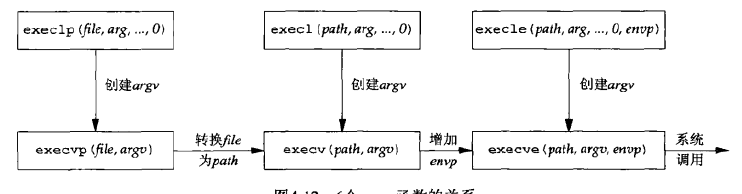

**几个套接字基础接口：**

	struct sockaddr_in serv;
	// 从进程到内核的套接字函数: bind、connect、sendto
	connect(sockfd, (sockaddr *) &serv, sizeof(serv))
	// 从内核到进程的套接字函数: accept、recvfrom、getscoketname、getpeername

**主机字节序和网络字节序转换函数：**

小端存储: 低字节在低地址，高字节在高地址, eg: 

	union {
		short s;
		char c[sizeof(short)];
	} un;
	un.s = 0x0102;
若为小端则: un.c[0] == 2 && un.c[1] == 1，若为大端则: un.c[0] == 1 && un.c[1] == 2；网络字节序为大端存储, 主机可能是大端也可能是小端存储。

	#include <netinet/in.h>
	
	uint16_t htons(uint16_t host16bitvalue);  // h表示host, n表示network, s表示short, 16位的端口号用此表示
	uint32_t htonl(uint32_t host32bitvalue); // 同上, l表示long, 32位的ip地址用此表示
	uint16_t ntohs(uint16_t net16bitvalue);
	uint32_t ntohl(uint32_t net32bitvalue);

**地址转换函数：**

inet\_aton、inet\_addr、inet\_ntoa在点分十进制数串(如 "10.254.48.216")与它长度为32的网络字节序二进制值之间转换IPv4地址, 其中a表示ascii，n表示numeric。

inet\_pton和inet\_ntop对于IPv4和IPv6地址都适用，其中p表示presentation, n表示numeric。
	
旧的接口：
	#include <arpa/inet.h>
	
	int inet_aton(const char *strptr, struct in_addr *addrptr); // 字符串有效则为1, 否则为0
	
	in_addr_t inet_addr(const char *strptr); //若字符串有效则为32位二进制网络字节序的IPv4地址, 否则为INADDR_NONE, **已废弃**
	
	char *inet_ntoa(struct in_addr inaddr); // 返回指向一个点分十进制数串的指针
	
最新接口：

	int inet_pton(int family, const char *strptr, void *addrptr); //若成功则返回1, 非有效表达式为0, 出错为-1
	
	const char *inet_ntop(int family, const void *addrptr, char *strptr, size_t len); //若成功则为指向结果的指针, 出错则为NULL

其中family取AF_INET或AF_INET6。

**socket函数：**

	#inlcude <sys/socket.h>
	int socket(int family, int type, int protocol);
	// family: AF_INET、AF_INET6...
	// type: SOCK_STREAM字节流套接字、SOCK_DGRAM数据报套接字、SOCK_SEQPACKET有序分组套接字、SOCK_RAW原始套接字
	// protocol: IPPROTO_TCP、IPPROTO_UDP、IPPROTO_SCTP

	                                                              TCP服务器
																  socket()
																	 ||
																   bind()
																	 ||
																  listen()
                                                                     ||
                                                                   accept()
																	 || 一直阻塞到客户端连接到达
		TCP客户端                                                     ||
		socket()                                                     ||
		   ||                  TCP三次握手                            ||
		connect() ---------------------------------------------------||
           ||                  数据请求
		write() ---------------------------------------------------->read()
                               数据应答                               || 处理请求
        read() <-----------------------------------------------------
		                       文件结束通知
		close() ----------------------------------------------------> read()
																	  close()
	// 成功返回0, 出错返回-1
	int connect(int sockfd, const struct sockaddr *servaddr, socklen_t addrlen)
	
	// 成功返回0, 出错返回-1, ip和端口都可选，如不指定则由内核选择。
	int bind(int sockfd, const struct sockaddr *myaddr, socklen_t addrlen) 
	
	// listen函数仅由TCP服务器调用, 当socket函数创建一个套接字时它被假设为一个主动套接字即
	// 它是一个将调用connect发起连接的客户套接字。listen函数将一个未连接的套接字转换成一个被动套接字，
	// 指示内核应接受指向该套接字的连接请求，调用listen将导致套接字从CLOSED状态转换到LISTEN状态。
	// 内核为每一个给定的监听套接字维护了两个队列：
	// 1)未完成连接队列: 服务器正在等待完成相应的TCP三路握手过程, 这些套接字处于SYN_RCVD状态。
	// 2)已完成连接队列, 已完成TCP三路握手, 这些套接字处于ESTABLISHED状态。
	// backlog指定了两种队列之和的最大数量, 当队列满时, TCP服务器将忽略客户端发来的SYN(如果返回RST将导致客户端终止而不会重试)
	int listen(int sockfd, int backlog)  // 成功返回0, 出错则为-1
	
	// 成功则返回非负描述符, 出错则-1。用于从已完成连接队列队头返回下一个已完成连接，如果已完成连接队列为空，
	// 那么进程被投入睡眠（假定套接字为默认的阻塞方式）, 第一个参数sockfd为前面的socket()创建的及bind函数
	// 和listen函数的第一个sockfd参数, 返回已连接队列中的代表与某个客户端连接的描述符。
	int accept(int sockfd, struct sockaddr *cliaddr, socklen_t *addrlen);
	
- **在收到tcp三次握手的第二个分节后，客户端的connect返回，在收到第三个分节后服务端的accept才会返回。**

**fork:**

	#include <unistd.h>
	
	pid_t fork(void); // 子进程中返回0, 父进程中返回子进程id, 出错则返回-1

父进程中调用fork之前打开的所有描述符在fork返回之后由子进程分享，父进程调用accept之后调用fork, 所接受的已连接套接字随后就在父进程与子进程之间共享。fork的两种典型用法：
	
1. 一个进程创建一个自身的副本, 这样每个副本都可以在另一个副本执行其他任务的同时处理各自的某个操作, 这是网络服务器的典型用法。
	
2. 一个进程想要执行另一个程序，进程调用fork创建一个自身的副本然后子进程调用exec把自身替换成新的程序，这是Shell之类程序的典型用法。存放在硬盘上的可执行程序文件能够被unix执行的唯一方法是由一个现有进程调用exec函数将当前进程映像替换成新的程序文件，该新程序通常从main函数开始执行，进程ID并不改变，称调用exec的进程为调用进程(calling process)，新执行的程序为新程序(new program), 注意是新程序而不是新进程，因为exec并没有创建新的进程。
	

		#include <unistd.h>
	
		int execl(const char *pathname, const char *arg0, .../* (char*) 0 */);
		int execv(const char *pathname, char *const argv[]);
		int execle(const char *pathname, const char *arg0, .../* (char*)0, char *const envp[] */);
		int execve(const char *pathname, char *const argv[], char *const envp[]);
		int execlp(const char *filename, const char *arg0, ... /* (char *) 0 */);
		int execvp(const char *filename, char *const argv[]);

调用关系图：

	
	int main(int argc, char **argv)
	{
		int listenfd, connfd;
		socklen_t len;
		struct sockaddr_in servaddr, cliaddr;
		listenfd = socket(AF_INET, SOCK_STREAM, 0);
		bzero(&servaddr, sizeof(servaddr));
		servaddr.sin_family = AF_INET;
		servaddr.sin_addr.s_addr = htonl(INADDR_ANY);
		servaddr.sin_port = htons(7000);
		bind(listenfd, (const struct servaddr*) &servaddr, sizeof(servaddr));
		listen(listenfd, LISTENQ);
		while (1){
			connfd = accept(listenfd, (struct servaddr*) &cliaddr, &len);
			// fork前只有父进程引用了listenfd、connfd，计数为1
			if (fork() == 0) {
				// 此时listenfd、connfd引用计数都为2
				close(listenfd); // 子进程中执行完后listenfd引用计数为1
				do_something();
				close(connfd);  // 子进程中执行完后connfd引用计数为0即被销毁
				exit(0)
			}
			close(connfd); // 执行完后引用计数为1, 注意这是在父进程中执行
		}
	}

**getsockname、getpeername：**

	#include <sys/socket.h>
	
	int getsockname(int sockfd, struct sockaddr *localaddr, socklen_t *addrlen);
	int getpeername(int sockfd, struct sockaddr *peeraddr, socklen_t *addrlen);

- 在没有调用bind的tcp客户端上, connect返回成功后getsockname用于返回由内核赋予该连接的本地ip地址和本地端口号；
	
		struct sockaddr_in saddr;
		socklen_t slen = sizeof(saddr);
		getsockname(sockfd, (SA*) &saddr, &slen);

- 以端口号0调用bind后, getsockname返回由内核赋予的本地端口号；

- 当一个服务器由调用过accept的某个进程通过调用exec执行程序时，使用getpeername获取客户身份。

tcp客户端example:
 
	// tcp客户端 client.c
	#include "unp.h"
	
	void str_cli(FILE *fp, int sockfd)
	{
	    char recvline[MAXLINE], sendline[MAXLINE];
	    while (fgets(sendline, MAXLINE, fp) > 0){
	        write(sockfd, sendline, strlen(sendline));
	        size_t n;
	        if ((n=read(sockfd, recvline, sizeof(recvline)) < 0))
	            err_sys("read socker error\n");
	        printf("%s", recvline);
	        //fputs(recvline, stdout);
	    }
	}
	
	int main(int argc, char **argv)
	{
	    int sockfd, n;
	    char recvline[MAXLINE+1];
	    struct sockaddr_in servaddr;
	    if (argc != 2) err_quit("usage: client <ip>");
	    if ((sockfd = socket(AF_INET, SOCK_STREAM, 0)) < 0)
	        err_sys("socket error");
	    bzero(&servaddr, sizeof(servaddr));
	    servaddr.sin_family = AF_INET;
	    servaddr.sin_port = htons(7000);
	    
	    if (inet_pton(AF_INET, argv[1], &servaddr.sin_addr) <= 0)
	        err_quit("inet_pton error for %s", argv[1]);
	
	    int connfd;
	    if (connect(sockfd, (struct sockaddr*) &servaddr, sizeof(servaddr)) < 0)
	        err_sys("connect error");
	    
	    str_cli(stdin, sockfd);
	
	    exit(0);
	}

tcp服务端example:

	// tcp服务端 server.c
	#include "unp.h"
	#include <time.h>
	
	void response(int connfd)
	{
		char buff[MAXLINE];
		const char *sign_str = " ==> reply from server\n";
		size_t n;
		
		again:
		while ((n=read(connfd, buff, MAXLINE)) > 0) {
		    printf("read succ, n: %d, %s", n, buff);
		    memcpy(buff+n-1, sign_str, strlen(sign_str)+1); 
		    writen(connfd, buff, n+strlen(sign_str));
		}
		
		printf("read socket: %d\n", n);
		
		if (n < 0 && errno == EINTR)
		    goto again;
		else if (n < 0)
		    err_sys("socket read error");
	}
	
	int main(int argc, char **argv)
	{
		int listenfd, connfd;
		socklen_t len;
		struct sockaddr_in servaddr, cliaddr;
		//char buff[MAXLINE];
		//time_t ticks;
		listenfd = socket(AF_INET, SOCK_STREAM, 0);
		bzero(&servaddr, sizeof(servaddr));
		servaddr.sin_family = AF_INET;
		servaddr.sin_addr.s_addr = htonl(INADDR_ANY);
		servaddr.sin_port = htons(7000);
		bind(listenfd, (const struct servaddr*) &servaddr, sizeof(servaddr));
		listen(listenfd, LISTENQ);
		char buff[MAXLINE];
		
		while(1) {
		    len = sizeof(cliaddr);
		    connfd = accept(listenfd, (struct servaddr*) &cliaddr, &len);
		    
		    printf("connection from %s, port %d\n",
		        inet_ntop(AF_INET, &cliaddr.sin_addr, buff, sizeof(buff)),
		        ntohs(cliaddr.sin_port));
		    
		    if (fork() == 0) {
		        close(listenfd);
		        response(connfd);
		        exit(0);
		    }
		    close(connfd);
		}
		exit(0);
	}

当客户端中止程序时（即输入CTRL-D），client.c的fgets将返回0, 从而触发main函数里的exit(0)，进程终止要处理的工作是有内核关闭
所有之前打开的描述服，这会导致客户端想服务端发送FIN及服务端返回ACK。此时服务器处于CLOSE\_WAIT状态，客户端处于FIN\_WAIT\_2状态；
服务端阻塞于read调用，在收到客户端发来的FIN时read返回0从而触发子进程的exit(0), 注意此时父进程仍然在主循环不会退出。 子进程的关闭将导致关闭对应的连接描述符，这将导致服务端向客户端发送FIN以及客户端的ACK。此时连接完全终止，客户端进入TIME\_WAIT状态。
**服务器子进程终止时内核将给父进程发送SIGCHLD信号，如不在程序捕获该信号将默认忽略该信号，将导致子进程进入僵死状态。**

**signal：**

- 由一个进程发给另一个进程（或自身）；
- 由内核发给某个进程。

可通过sigaction函数设定一个信号的处理，信号处理函数原型：
	
	void handler(int signo);
	# tips: 关于函数指针
	# 以函数声明void * (*(*func)(int))[10]为例, 从内至外分析
	# (*func)(int)表示func是一个函数指针, 参数是int类型, 那么func代表的函数返回值是什么呢？
	# *(*func)(int)最外层的*表示func代表的函数是返回一个指针类型，那么这个指针是什么类型的指针呢？
	# 最外面的是void * [10]，因此返回一个指向void* [10]的指针
	# 再举个例子：int* (*func2)(int)[10]，不难分析出func2是一个返回值为int* [10]，参数是int类型的函数指针，但是数组int* [10]是不能直接做为返回类型声明的，因此会编译失败。
	# 最后一个例子：int(* (*func3)(int))[10]，func3的参数是int类型，返回值是一个指向int[10]的指针。
	
	# 最后再回到signal的函数声明：
	void(*signal(int, void (*)(int)))(int);
	# 最里面层为：*signal(int, void (*)(int))，表示signal是个函数指针，第一个参数为int，第二个参数是返回类型为
	# void参数类型是int的函数指针，最外层是void (int)表示signal的返回值也是一个void (int)类型的函数指针，因此上
	# 面的定义可等价于：
	typedef void handleFunc(int);
	handleFunc* signal(int, handleFunc *func);

注意：**SIGKILL和SIGSTOP信号不能被捕获**。

	// tcp服务端 server.c
	#include "unp.h"
	#include <time.h>
	
	typedef void sigHandler(int);
	
	// 系统signal包装函数
	sigHandler* signal(int signo, sigHandler *func)
	{
		struct sigaction act, oact;
		act.sa_handler = func;
		// sa_mask为阻塞信号集，表示该信号处理函数func在被调用时, 里面的信号将被阻塞递交
		// 这里设置为空表示不阻塞任何额外信号
		sigemptyset(&act.sa_mask);
		act.sa_flags = 0;
		// 由signo信号中断的系统调用将由内核自动重启, 但是SIGALRM例外
		// 因为SIGALRM信号通常是I/O操作设置超时，这种情况下我们希望被阻塞的系统调用能被信号中断掉
		if (signo == SIGALRM){
		#ifdef SA_INTERRUPT
			act.sa_flags |= SA_INTERRUPT;
		#endif
		} else {
		#ifdef SA_RESTART
			act.sa_flags |= SA_RESTART;
		#endif
		}
		
		if (sigaction(signo, &act, &oact) < 0)
			return SIG_ERR;
		return oact.sa_handler;
	}

	void response(int connfd)
	{
		char buff[MAXLINE];
		const char *sign_str = " ==> reply from server\n";
		size_t n;
		
		again:
		while ((n=read(connfd, buff, MAXLINE)) > 0) {
		    printf("read succ, n: %d, %s", n, buff);
		    memcpy(buff+n-1, sign_str, strlen(sign_str)+1); 
		    writen(connfd, buff, n+strlen(sign_str));
		}
		
		printf("read socket: %d\n", n);
		
		if (n < 0 && errno == EINTR)
		    goto again;
		else if (n < 0)
		    err_sys("socket read error");
	}

	int main(int argc, char **argv)
	{
		int listenfd, connfd;
		socklen_t len;
		struct sockaddr_in servaddr, cliaddr;
		//char buff[MAXLINE];
		//time_t ticks;
		listenfd = socket(AF_INET, SOCK_STREAM, 0);
		bzero(&servaddr, sizeof(servaddr));
		servaddr.sin_family = AF_INET;
		servaddr.sin_addr.s_addr = htonl(INADDR_ANY);
		servaddr.sin_port = htons(7000);
		bind(listenfd, (const struct servaddr*) &servaddr, sizeof(servaddr));
		listen(listenfd, LISTENQ);
		
		//处理SIGCHLD信号
		signal(SIGCHLD, sig_chld);
		
		char buff[MAXLINE];
		
		while(1) {
		    len = sizeof(cliaddr);
		    connfd = accept(listenfd, (struct servaddr*) &cliaddr, &len);
		    
		    printf("connection from %s, port %d\n",
		        inet_ntop(AF_INET, &cliaddr.sin_addr, buff, sizeof(buff)),
		        ntohs(cliaddr.sin_port));
		    
		    if (fork() == 0) {
		        close(listenfd);
		        response(connfd);
		        exit(0);
		    }
		    close(connfd);
		}
		exit(0);
	}

注意：
 
1. 如果一个信号在被阻塞期间产生了一次或多次，那么该信号在解阻塞之后通常只递交一次，即Unix信号默认是不排队的。 可以使用
   sigprocmask函数选择性地阻塞或解阻塞一组信号，比如在一段临界区代码中防止捕获某些信号；

2. 若注释掉 act.sa\_flags |= SA\_RESTART; 则客户端在终止时，服务端子进程会收到FIN导致exit，于是父进程收到SIGCHLD，而此前
   父进程一直阻塞于慢系统调用accept，因为该信号将导致内核中断该accept系统调用(在信号处理函数的return或结尾的地方中断)，返回EINTR，而父进程并未处理这种错误，在某些系统会直接终止，而某些系统则因为accept出错提前返回将不停执行后续的fork逻辑部分。act.sa\_flags |= SA\_RESTART未注释，则被SIGCHLD信号中断的accept系统调用将被内核自动重启，从而保证进程正常运行。