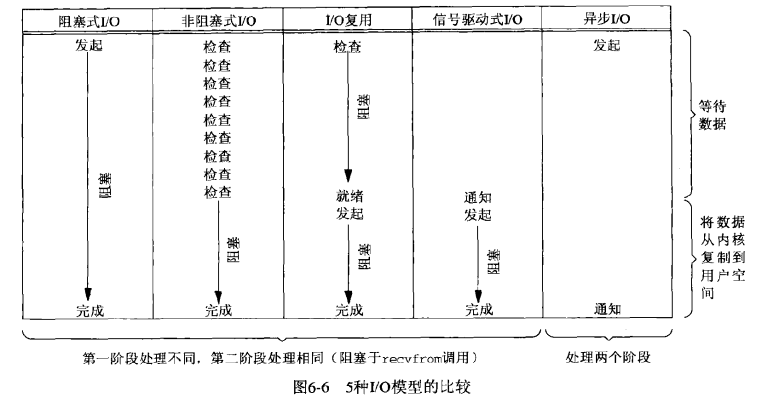

**几个套接字基础接口：**

	struct sockaddr_in serv;
	// 从进程到内核的套接字函数: bind、connect、sendto
	connect(sockfd, (sockaddr *) &serv, sizeof(serv))
	// 从内核到进程的套接字函数: accept、recvfrom、getscoketname、getpeername

**主机字节序和网络字节序转换函数：**

小端存储: 低字节在低地址，高字节在高地址, eg: 

	union {
		short s;
		char c[sizeof(short)];
	} un;
	un.s = 0x0102;
若为小端则: un.c[0] == 2 && un.c[1] == 1，若为大端则: un.c[0] == 1 && un.c[1] == 2；网络字节序为大端存储, 主机可能是大端也可能是小端存储。

	#include <netinet/in.h>
	
	uint16_t htons(uint16_t host16bitvalue);  // h表示host, n表示network, s表示short, 16位的端口号用此表示
	uint32_t htonl(uint32_t host32bitvalue); // 同上, l表示long, 32位的ip地址用此表示
	uint16_t ntohs(uint16_t net16bitvalue);
	uint32_t ntohl(uint32_t net32bitvalue);

**地址转换函数：**

inet\_aton、inet\_addr、inet\_ntoa在点分十进制数串(如 "10.254.48.216")与它长度为32的网络字节序二进制值之间转换IPv4地址, 其中a表示ascii，n表示numeric。

inet\_pton和inet\_ntop对于IPv4和IPv6地址都适用，其中p表示presentation, n表示numeric。
	
旧的接口：
	#include <arpa/inet.h>
	
	int inet_aton(const char *strptr, struct in_addr *addrptr); // 字符串有效则为1, 否则为0
	
	in_addr_t inet_addr(const char *strptr); //若字符串有效则为32位二进制网络字节序的IPv4地址, 否则为INADDR_NONE, **已废弃**
	
	char *inet_ntoa(struct in_addr inaddr); // 返回指向一个点分十进制数串的指针
	
最新接口：

	int inet_pton(int family, const char *strptr, void *addrptr); //若成功则返回1, 非有效表达式为0, 出错为-1
	
	const char *inet_ntop(int family, const void *addrptr, char *strptr, size_t len); //若成功则为指向结果的指针, 出错则为NULL

其中family取AF_INET或AF_INET6。

**socket函数：**

	#inlcude <sys/socket.h>
	int socket(int family, int type, int protocol);
	// family: AF_INET、AF_INET6...
	// type: SOCK_STREAM字节流套接字、SOCK_DGRAM数据报套接字、SOCK_SEQPACKET有序分组套接字、SOCK_RAW原始套接字
	// protocol: IPPROTO_TCP、IPPROTO_UDP、IPPROTO_SCTP

	                                                              TCP服务器
																  socket()
																	 ||
																   bind()
																	 ||
																  listen()
                                                                     ||
                                                                   accept()
																	 || 一直阻塞到客户端连接到达
		TCP客户端                                                     ||
		socket()                                                     ||
		   ||                  TCP三次握手                            ||
		connect() ---------------------------------------------------||
           ||                  数据请求
		write() ---------------------------------------------------->read()
                               数据应答                               || 处理请求
        read() <-----------------------------------------------------
		                       文件结束通知
		close() ----------------------------------------------------> read()
																	  close()
	// 成功返回0, 出错返回-1
	int connect(int sockfd, const struct sockaddr *servaddr, socklen_t addrlen)
	
	// 成功返回0, 出错返回-1, ip和端口都可选，如不指定则由内核选择。
	int bind(int sockfd, const struct sockaddr *myaddr, socklen_t addrlen) 
	
	// listen函数仅由TCP服务器调用, 当socket函数创建一个套接字时它被假设为一个主动套接字即
	// 它是一个将调用connect发起连接的客户套接字。listen函数将一个未连接的套接字转换成一个被动套接字，
	// 指示内核应接受指向该套接字的连接请求，调用listen将导致套接字从CLOSED状态转换到LISTEN状态。
	// 内核为每一个给定的监听套接字维护了两个队列：
	// 1)未完成连接队列: 服务器正在等待完成相应的TCP三路握手过程, 这些套接字处于SYN_RCVD状态。
	// 2)已完成连接队列, 已完成TCP三路握手, 这些套接字处于ESTABLISHED状态。
	// backlog指定了两种队列之和的最大数量, 当队列满时, TCP服务器将忽略客户端发来的SYN(如果返回RST将导致客户端终止而不会重试)
	int listen(int sockfd, int backlog)  // 成功返回0, 出错则为-1
	
	// 成功则返回非负描述符, 出错则-1。用于从已完成连接队列队头返回下一个已完成连接，如果已完成连接队列为空，
	// 那么进程被投入睡眠（假定套接字为默认的阻塞方式）, 第一个参数sockfd为前面的socket()创建的及bind函数
	// 和listen函数的第一个sockfd参数, 返回已连接队列中的代表与某个客户端连接的描述符。
	int accept(int sockfd, struct sockaddr *cliaddr, socklen_t *addrlen);
	
- **在收到tcp三次握手的第二个分节后，客户端的connect返回，在收到第三个分节后服务端的accept才会返回。**

**fork:**

	#include <unistd.h>
	
	pid_t fork(void); // 子进程中返回0, 父进程中返回子进程id, 出错则返回-1

父进程中调用fork之前打开的所有描述符在fork返回之后由子进程分享，父进程调用accept之后调用fork, 所接受的已连接套接字随后就在父进程与子进程之间共享。fork的两种典型用法：
	
1. 一个进程创建一个自身的副本, 这样每个副本都可以在另一个副本执行其他任务的同时处理各自的某个操作, 这是网络服务器的典型用法。
	
2. 一个进程想要执行另一个程序，进程调用fork创建一个自身的副本然后子进程调用exec把自身替换成新的程序，这是Shell之类程序的典型用法。存放在硬盘上的可执行程序文件能够被unix执行的唯一方法是由一个现有进程调用exec函数将当前进程映像替换成新的程序文件，该新程序通常从main函数开始执行，进程ID并不改变，称调用exec的进程为调用进程(calling process)，新执行的程序为新程序(new program), 注意是新程序而不是新进程，因为exec并没有创建新的进程。
	

		#include <unistd.h>
	
		int execl(const char *pathname, const char *arg0, .../* (char*) 0 */);
		int execv(const char *pathname, char *const argv[]);
		int execle(const char *pathname, const char *arg0, .../* (char*)0, char *const envp[] */);
		int execve(const char *pathname, char *const argv[], char *const envp[]);
		int execlp(const char *filename, const char *arg0, ... /* (char *) 0 */);
		int execvp(const char *filename, char *const argv[]);

调用关系图：

	
	int main(int argc, char **argv)
	{
		int listenfd, connfd;
		socklen_t len;
		struct sockaddr_in servaddr, cliaddr;
		listenfd = socket(AF_INET, SOCK_STREAM, 0);
		bzero(&servaddr, sizeof(servaddr));
		servaddr.sin_family = AF_INET;
		servaddr.sin_addr.s_addr = htonl(INADDR_ANY);
		servaddr.sin_port = htons(7000);
		bind(listenfd, (const struct servaddr*) &servaddr, sizeof(servaddr));
		listen(listenfd, LISTENQ);
		while (1){
			connfd = accept(listenfd, (struct servaddr*) &cliaddr, &len);
			// fork前只有父进程引用了listenfd、connfd，计数为1
			if (fork() == 0) {
				// 此时listenfd、connfd引用计数都为2
				close(listenfd); // 子进程中执行完后listenfd引用计数为1
				do_something();
				close(connfd);  // 子进程中执行完后connfd引用计数为0即被销毁
				exit(0)
			}
			close(connfd); // 执行完后引用计数为1, 注意这是在父进程中执行
		}
	}

**getsockname、getpeername：**

	#include <sys/socket.h>
	
	int getsockname(int sockfd, struct sockaddr *localaddr, socklen_t *addrlen);
	int getpeername(int sockfd, struct sockaddr *peeraddr, socklen_t *addrlen);

- 在没有调用bind的tcp客户端上, connect返回成功后getsockname用于返回由内核赋予该连接的本地ip地址和本地端口号；
	
		struct sockaddr_in saddr;
		socklen_t slen = sizeof(saddr);
		getsockname(sockfd, (SA*) &saddr, &slen);

- 以端口号0调用bind后, getsockname返回由内核赋予的本地端口号；

- 当一个服务器由调用过accept的某个进程通过调用exec执行程序时，使用getpeername获取客户身份。

tcp客户端example:
 
	// tcp客户端 client.c
	#include "unp.h"
	
	void str_cli(FILE *fp, int sockfd)
	{
	    char recvline[MAXLINE], sendline[MAXLINE];
	    while (fgets(sendline, MAXLINE, fp) > 0){
	        write(sockfd, sendline, strlen(sendline));
	        size_t n;
	        if ((n=read(sockfd, recvline, sizeof(recvline)) <= 0))
	            err_quit("server termiated\n");
	        printf("%s", recvline);
	        //fputs(recvline, stdout);
	    }
	}
	
	int main(int argc, char **argv)
	{
	    int sockfd, n;
	    char recvline[MAXLINE+1];
	    struct sockaddr_in servaddr;
	    if (argc != 2) err_quit("usage: client <ip>");
	    if ((sockfd = socket(AF_INET, SOCK_STREAM, 0)) < 0)
	        err_sys("socket error");
	    bzero(&servaddr, sizeof(servaddr));
	    servaddr.sin_family = AF_INET;
	    servaddr.sin_port = htons(7000);
	    
	    if (inet_pton(AF_INET, argv[1], &servaddr.sin_addr) <= 0)
	        err_quit("inet_pton error for %s", argv[1]);
	
	    int connfd;
	    if (connect(sockfd, (struct sockaddr*) &servaddr, sizeof(servaddr)) < 0)
	        err_sys("connect error");
	    
	    str_cli(stdin, sockfd);
	
	    exit(0);
	}

tcp服务端example:

	// tcp服务端 server.c
	#include "unp.h"
	#include <time.h>
	
	void response(int connfd)
	{
		char buff[MAXLINE];
		const char *sign_str = " ==> reply from server\n";
		size_t n;
		
		again:
		while ((n=read(connfd, buff, MAXLINE)) > 0) {
		    printf("read succ, n: %d, %s", n, buff);
		    memcpy(buff+n-1, sign_str, strlen(sign_str)+1); 
		    writen(connfd, buff, n+strlen(sign_str));
		}
		
		printf("read socket: %d\n", n);
		
		if (n < 0 && errno == EINTR)
		    goto again;
		else if (n < 0)
		    err_sys("socket read error");
	}
	
	int main(int argc, char **argv)
	{
		int listenfd, connfd;
		socklen_t len;
		struct sockaddr_in servaddr, cliaddr;
		//char buff[MAXLINE];
		//time_t ticks;
		listenfd = socket(AF_INET, SOCK_STREAM, 0);
		bzero(&servaddr, sizeof(servaddr));
		servaddr.sin_family = AF_INET;
		servaddr.sin_addr.s_addr = htonl(INADDR_ANY);
		servaddr.sin_port = htons(7000);
		bind(listenfd, (const struct servaddr*) &servaddr, sizeof(servaddr));
		listen(listenfd, LISTENQ);
		char buff[MAXLINE];
		
		while(1) {
		    len = sizeof(cliaddr);
		    connfd = accept(listenfd, (struct servaddr*) &cliaddr, &len);
		    
		    printf("connection from %s, port %d\n",
		        inet_ntop(AF_INET, &cliaddr.sin_addr, buff, sizeof(buff)),
		        ntohs(cliaddr.sin_port));
		    
		    if (fork() == 0) {
		        close(listenfd);
		        response(connfd);
		        exit(0);
		    }
		    close(connfd);
		}
		exit(0);
	}

当客户端中止程序时（即输入CTRL-D），client.c的fgets将返回0, 从而触发main函数里的exit(0)，进程终止要处理的工作是有内核关闭
所有之前打开的描述服，这会导致客户端想服务端发送FIN及服务端返回ACK。此时服务器处于CLOSE\_WAIT状态，客户端处于FIN\_WAIT\_2状态；
服务端阻塞于read调用，在收到客户端发来的FIN时read返回0从而触发子进程的exit(0), 注意此时父进程仍然在主循环不会退出。 子进程的关闭将导致关闭对应的连接描述符，这将导致服务端向客户端发送FIN以及客户端的ACK。此时连接完全终止，客户端进入TIME\_WAIT状态。
**服务器子进程终止时内核将给父进程发送SIGCHLD信号，如不在程序捕获该信号将默认忽略该信号，将导致子进程进入僵死状态。**

**signal：**

- 由一个进程发给另一个进程（或自身）；
- 由内核发给某个进程。

可通过sigaction函数设定一个信号的处理，信号处理函数原型：
	
	void handler(int signo);
	# tips: 关于函数指针
	# 以函数声明void * (*(*func)(int))[10]为例, 从内至外分析
	# (*func)(int)表示func是一个函数指针, 参数是int类型, 那么func代表的函数返回值是什么呢？
	# *(*func)(int)最外层的*表示func代表的函数是返回一个指针类型，那么这个指针是什么类型的指针呢？
	# 最外面的是void * [10]，因此返回一个指向void* [10]的指针
	# 再举个例子：int* (*func2)(int)[10]，不难分析出func2是一个返回值为int* [10]，参数是int类型的函数指针，但是数组int* [10]是不能直接做为返回类型声明的，因此会编译失败。
	# 最后一个例子：int(* (*func3)(int))[10]，func3的参数是int类型，返回值是一个指向int[10]的指针。
	
	# 最后再回到signal的函数声明：
	void(*signal(int, void (*)(int)))(int);
	# 最里面层为：*signal(int, void (*)(int))，表示signal是个函数指针，第一个参数为int，第二个参数是返回类型为
	# void参数类型是int的函数指针，最外层是void (int)表示signal的返回值也是一个void (int)类型的函数指针，因此上
	# 面的定义可等价于：
	typedef void handleFunc(int);
	handleFunc* signal(int, handleFunc *func);

注意：**SIGKILL和SIGSTOP信号不能被捕获**。

	// tcp服务端 server.c
	#include "unp.h"
	#include <time.h>
	
	typedef void sigHandler(int);
	
	// 系统signal包装函数
	sigHandler* signal(int signo, sigHandler *func)
	{
		struct sigaction act, oact;
		act.sa_handler = func;
		// sa_mask为阻塞信号集，表示该信号处理函数func在被调用时, 里面的信号将被阻塞递交
		// 这里设置为空表示不阻塞任何额外信号
		sigemptyset(&act.sa_mask);
		act.sa_flags = 0;
		// 由signo信号中断的系统调用将由内核自动重启, 但是SIGALRM例外
		// 因为SIGALRM信号通常是I/O操作设置超时，这种情况下我们希望被阻塞的系统调用能被信号中断掉
		if (signo == SIGALRM){
		#ifdef SA_INTERRUPT
			act.sa_flags |= SA_INTERRUPT;
		#endif
		} else {
		#ifdef SA_RESTART
			act.sa_flags |= SA_RESTART;
		#endif
		}
		
		if (sigaction(signo, &act, &oact) < 0)
			return SIG_ERR;
		return oact.sa_handler;
	}

	void response(int connfd)
	{
		char buff[MAXLINE];
		const char *sign_str = " ==> reply from server\n";
		size_t n;
		
		again:
		while ((n=read(connfd, buff, MAXLINE)) > 0) {
		    printf("read succ, n: %d, %s", n, buff);
		    memcpy(buff+n-1, sign_str, strlen(sign_str)+1); 
		    writen(connfd, buff, n+strlen(sign_str));
		}
		
		printf("read socket: %d\n", n);
		
		if (n < 0 && errno == EINTR)
		    goto again;
		else if (n < 0)
		    err_sys("socket read error");
	}
	
	// 信号处理函数（有问题版本）
	void sig_chld(int signo)
	{
		pid_t pid;
		int stat;
		pid = wait(&stat);
		return;
	}	

	int main(int argc, char **argv)
	{
		int listenfd, connfd;
		socklen_t len;
		struct sockaddr_in servaddr, cliaddr;
		//char buff[MAXLINE];
		//time_t ticks;
		listenfd = socket(AF_INET, SOCK_STREAM, 0);
		bzero(&servaddr, sizeof(servaddr));
		servaddr.sin_family = AF_INET;
		servaddr.sin_addr.s_addr = htonl(INADDR_ANY);
		servaddr.sin_port = htons(7000);
		bind(listenfd, (const struct servaddr*) &servaddr, sizeof(servaddr));
		listen(listenfd, LISTENQ);
		
		//处理SIGCHLD信号
		signal(SIGCHLD, sig_chld);
		
		char buff[MAXLINE];
		
		while(1) {
		    len = sizeof(cliaddr);
		    connfd = accept(listenfd, (struct servaddr*) &cliaddr, &len);
		    
		    printf("connection from %s, port %d\n",
		        inet_ntop(AF_INET, &cliaddr.sin_addr, buff, sizeof(buff)),
		        ntohs(cliaddr.sin_port));
		    
		    if (fork() == 0) {
		        close(listenfd);
		        response(connfd);
		        exit(0);
		    }
		    close(connfd);
		}
		exit(0);
	}

注意：
 
1. 如果一个信号在被阻塞期间产生了一次或多次，那么该信号在解阻塞之后通常只递交一次，即Unix信号默认是不排队的。 可以使用
   sigprocmask函数选择性地阻塞或解阻塞一组信号，比如在一段临界区代码中防止捕获某些信号；

2. 若注释掉 act.sa\_flags |= SA\_RESTART; 则客户端在终止时，服务端子进程会收到FIN导致exit，于是父进程收到SIGCHLD，而此前
   父进程一直阻塞于慢系统调用accept，因为该信号将导致内核中断该accept系统调用(在信号处理函数的return或结尾的地方中断)，返回EINTR，而父进程并未处理这种错误，在某些系统会直接终止，而某些系统则因为accept出错提前返回将不停执行后续的fork逻辑部分。act.sa\_flags |= SA\_RESTART未注释，则被SIGCHLD信号中断的accept系统调用将被内核自动重启，从而保证进程正常运行。但是有
   可能某些系统并不支持重启被信号中断的系统调用，因此可移植地改法是在程序里处理被信号中断的情况：
		
		... // 省略
		while(1) {
		    len = sizeof(cliaddr);
		    if ((connfd = accept(listenfd, (struct servaddr*) &cliaddr, &len)) < 0) {
				if (errno == EINTR)
					continue; // 自动重启
				else
					err_sys("accept error");
			}
		    
		    ... //省略
		}

	对于accept、read、write、select、open之类函数可以这样处理，但connect不能重启，如果connect返回EINTR，我们不能再次调用它，否则将立即返回一个错误，当connect被一个捕获的信号中断而且不自动重启时，我们必须调用select来等待连接完成。

**wait与waitpid：** 都可用来清理已终止子进程

	#include <sys/wait.h>
	// 均返回：若成功则为进程ID，若出错则为0或-1
	// 如果调用wait的进程没有已终止的子进程，不过有一个或多个子进程正在执行，则阻塞到有子进程终止为止
	pid_t wait(int *statloc);

	// pid可指定等待哪个子进程，若为-1则表示等待第一个终止的进程，options允许指定附加选项，常用的是WNOHANG表示在没有已终止的子进程时不要阻塞
	pid_t waitpid(pid_t pid, int *statloc, int options);

当同时有多个客户端连接时，建立一个信号处理函数并在其中调用wait并不足以防止出现僵死进程。因为unix信号一般是不排队的，如果信号处理函数正在执行时依次收到其他子进程的信号，那么当信号处理函数执行完毕后只会再执行一次，从而可能导致产生僵死进程，正确地解决办法是使用waitpid。

	void sig_chld(int signo)
	{
		pid_t pid;
		int stat;
		while ((pid = waitpid(-1, &stat, WNOHANG)) > 0)
			printf("child %d terminated\n", pid);
		return;
	}

使用上述信号处理函数能work的原因在于：使用了循环去逐个wait已终止的子进程，因此所有已终止的子进程都会被处理，wait能否也使用循环呢？答案当然是否定的，因为wait做不到在没有已终止的子进程时不阻塞，也就是说如果对wait使用循环那么当没有已终止的子进程时父进程会被阻塞，这显然是不行的，而waitpid的WNOHANG选项可以保证在没有已终止的子进程时不阻塞。

**结论：**

1. 当fork子进程时必须捕获SIGCHLD信号；
2. 当捕获信号时，必须处理被中断的系统调用；
3. SIGCHLD的信号处理函数必须正确编写，应使用waitpid函数以免留下僵死进程。

**accept返回前连接终止：** tcp三路握手完成后tcp客户端却发送了一个RST(复位)，服务器进程调用accept的时候RST到达，POSIX指出在这种情况返回的errno必须是ECONNABORTED（但不同系统在具体实现的时候不尽相同），服务器进程遇到这种错误时就可以忽略它再次调用accept就行。

**服务器进程终止：** 使用kill命令杀掉tcp服务端子进程，子进程中所有打开的描述符都被关闭，将导致向客户发送一个FIN，客户tcp响应ACK，但是按此前设计的tcp客户端str\_cli函数，这时仍然阻塞于fgets调用等待用户输入，一旦用户输入后tcp客户将把数据发送给服务器，tcp允许这么干是因为tcp客户收到FIN只是表示服务器进程已经关闭的连接的服务器端不会再往客户发送任何数据而已，但FIN的接收并没有告知tcp服务器进程已经终止（本例中确实是终止了），因为tcp客户认为服务端进程仍然可以接收数据。**当tcp服务端接收到来自客户的数据时，因为该客户关联的套接字进程已经终止，于是相应一个RST。但是客户端看不到这个RST**，因为此时客户端正阻塞于read调用，而根据之前接收的FIN，read调用立即返回0(表示EOF)，于是执行err_quit函数终止客户端。这个例子问题在于tcp客户端在应对两个描述符————套接字和用户输入，它不能单纯地阻塞在这两个源中某个特定源的输入上，也就是说即使服务端已经发送FIN给客户端了，但客户端可能正阻塞于用户输入导致不能立马获知已收到FIN。

**SIGPIPE:** 向某个已接收到RST的套接字执行写操作时，内核向该进程发送一个SIGPIPE信号，该信号的默认行为是终止进程，因此进程必须捕获它或者设置忽略该信号以免进程被不情愿地终止。 但无论该进程是捕获了该信号并从其信号处理函数返回还是简单地忽略该信号，写操作都将返回EPIPE错误。 **写一个已接收了FIN的套接字将引发服务端发送RST, 写一个已接收了RST的套接字将引发SIGPIPE信号**。

	#include "unp.h"
	
	void str_cli(FILE *fp, int sockfd)
	{
	    char recvline[MAXLINE], sendline[MAXLINE];
	    while (fgets(sendline, MAXLINE, fp) > 0){
			write(sockfd, sendline, 1);
			sleep(1);
	        write(sockfd, sendline+1, strlen(sendline)-1);
	        size_t n;
	        if ((n=read(sockfd, recvline, sizeof(recvline)) <= 0))
	            err_quit("server termiated\n");
	        printf("%s", recvline);
	        //fputs(recvline, stdout);
	    }
	}

客户端正阻塞于fgets，杀掉服务端子进程，然后客户端键入一行文本，第一次write会引发RST, 第二次写会引发SIGPIPE信号，由于进程并未捕获该信号，因此进程将被终止。可行的做法是直接将SIGPIPE设置SIG_IGN，然后在write后处理返回的EPIPE错误。

**服务器主机崩溃：** tcp客户端会在write后阻塞于read调用，但由于服务端不可达，因此客户端会一直重传数据直到超时，然后readline调用返回错误ETIMEOUT，如果某个中间路由器判定服务器主机已不可达，则响应一个ICMP消息，客户端返回错误EHOSTUNREACH或ENETUNREACH。如果想要不主动向服务端发送数据就能检测出服务器主机崩溃，那么需要使用SO_KEEPALIVE套接字选项。

**服务器主机崩溃后重启：** 服务器主机重启后，它的tcp丢失了崩溃前的所有连接信息，因此服务器tcp对于收到来自客户的数据分节响应一个RST。tcp客户端收到该RST时，read调用返回ECONNRESET错误。

**服务器主机关机：** unix系统关机时，init进程通常会先给所有进程发送SIGTERM信号（可被捕获），等待一段固定时间（通常5到20秒之间），然后给所有仍在运行的进程发送SIGKILL信号（不可被捕获）并终止。如果我们忽略SIGTERM信号，那么服务器将由SIGKILL信号终止，而SIGTERM的默认处置也是终止进程，即我们必须捕获SIGTERM才不至于被意外终止。

## I/O复用： ##

定义：内核在进程指定的一个或多个描述符就绪时通知给进程的能力即为I/O复用。

几种I/O模型：

- 阻塞式I/O，之前的所有例子都是这种类型；
- 非阻塞式I/O，也称轮询，较少使用；
- I/O复用，阻塞于select调用，但与普通阻塞式I/O区别是select可以监听多个描述符而不是一个；
- 多线程阻塞式I/O，对每个套接字开个线程阻塞调用
- 信号驱动式I/O，内核在描述符就绪时发送SIGIO信号通知进程（该阶段非阻塞），进程可以在信号处理函数中调用recvfrom读取数据报。
- 异步I/O模型，告知内核启动某个操作，并让内核在整个操作（包括数据从内核复制到进程缓冲区）完成后通知进程。与信号驱动I/O模型区别是：信号驱动I/O由内核通知我们何时可以启动一个I/O操作，而异步I/O模型则是由内核通知我们I/O操作何时完成。

上述几种模型除了异步I/O模型外，其余几种模型都是在第一阶段即描述符就绪阶段有区别，而读取数据报阶段则相同，它们都是阻塞式I/O模型，因为在recvfrom阶段是阻塞的。

**select：** 该函数允许进程指示内核等待多个事件中的任何一个发生，并只在有一个或多个事件发生时或者超时后才唤醒进程。

	#include <sys/select.h>
	#include <sys/time.h>
	
	int select(int maxfdp1, fd_set *readset, fd_set *writeset, fd_set *exceptset, const struct timeval *timeout);
	
	struct timeval {
		long tv_sec;  // 秒
		long tv_usec; // 微秒
	}
timeout参数告知内核等待所指定的描述符就绪的最大时长。 

- timeout为NULL表示永远等待下去，直到有一个描述符准备好I/O；
- 等待固定时间，在有一个描述符就绪时返回，但是不超过timeout指定的秒数与微秒数；
- 根本不等待，检查描述符后立即返回，这种方式为轮询(polling)，将timeout的秒与微秒都设为0。

readset、writeset、exceptset指定内核测试读、写、异常的描述符，若对其中某个条件不感兴趣可以设置为空指针。

- void FD_ZERO(fd\_set *fdset);   // 清空fdset
- void FD_SET(fd, fd\_set *fdset);  // 打开fdset的第fd个bit的开关
- void FD_CLR(int fd, fd\_set *fdset);  //关闭fdset的第fd个bit的开关
- int FD_ISSET(int fd, fd\_set *fdset); // fdset的第fd个开关是否被打开

maxfdp1指定待测试的描述符个数，其值为待测试的最大描述符加1（maxfd plus 1)，描述符0, 1, 2, ... maxfdp1-1都会被测试。

**描述符就绪条件**：

1) 满足下列任何一个条件时，一个套接字准备好读：

- 该套接字接收缓冲区的数据字节数大于等于套接字接收缓冲区低水位标记大小，可以设置SO_RCVLOWAT套接字选项，对tcp和udp默认为1。对这样的套接字执行读操作不阻塞并将返回一个大于0的值。
- 该连接的读半部关闭（即收到了FIN的tcp连接），对这样的套接字执行读操作不阻塞并且返回0（即EOF）。
- 该套接字是一个监听套接字且已完成的连接数不为0。
- 该套接字有一个错误待处理，对这样的套接字执行读操作不阻塞并返回-1，同时把errno设置成确切的错误条件。

2）满足下列任何一个条件时，一个套接字准备好写：

- 该套接字发送缓冲区中的可用空间字节数大于等于套接字发送缓冲区低水位标记大小，并且该套接字已连接或者该套接字不需要连接（udp套接字），可以使用SO_SNDLOWAT套接字选项来设置该套接字的低水位标记，对tcp和udp而言，其默认值为2048。
- 该连接的写半部关闭，对这样的套接字写将产生SIGPIPE信号。
- 使用非阻塞式connect的套接字已建立连接或者connect已经以失败告终。
- 其上有一个套接字错误待处理，对这样的套接字写将不阻塞且返回-1，同时errno被设置成确切的错误条件。

3）如果一个套接字存在带外数据或者仍然处于带外标记，那么有异常条件待处理。

**注意：** **当select函数返回时将修改由指针readset、writeset、exceptset所指向的描述符集，描述符集内任何与未就绪描述符对应的位都被清为0，因此每次重新调用select函数时都得再次把所有描述符集内关心的为重置为1**。

**改进版的str_cli：**

	#include "unp.h"
	
	void str_cli(FILE *fp, int sockfd)
	{
		int madfdp1;
		fd_set rset;
	    char recvline[MAXLINE], sendline[MAXLINE];
	    FD_ZERO(&rset);
		while (true){
			FD_SET(fileno(fp), &rset);
			FD_SET(sockfd, &rset);
			maxfdp1 = max(fileno(fp), sockfd) + 1;
			select(maxfdp1, &rset, NULL, NULL, NULL);
			
			if (FD_ISSET(sockfd, &rset)) { /* socket is readable */
				if (readline(sockfd, recvline, MAXLINE) == 0)
					err_quit("str_cli: server terminated prematurely");
				fputs(recvline, stdout);
			}
			
			if (FD_ISSET(fileno(fp), &rset)) { /* input is readable */
				if (fgets(sendline, MAXLINE, fp) == NULL)
					return;
				writen(sockfd, sendline, strlen(sendline));
			}
	    }
	}

改版本str_cli仍然有问题，输入端终止后会立即回到main函数执行exit终止进程，但这时可能仍然有请求正在途中。

**shutdown：**

	#include <sys/socket.h>
	
	int shutdown(int sockfd, int howto);

howto:

- SHUT_RD：关闭套接字读，丢掉套接字接收缓冲区中的数据，对一个tcp套接字而言，对端发来的所有数据都被确认然后丢弃。
- SHUT_WR：关闭套接字写，套接字发送缓冲区的数据会被立即发送，后跟tcp的正常连接终止序列，无视tcp套接字的引用计数。
- SHUT_RDWR：读写都关闭，等价于关闭两次SHUT_RD、SHUT_WR

**select服务端程序：**

	#include "unp.h"
	
	int main(int argc, char **argv)
	{
		int listenfd, connfd, i, maxi, maxfd;
		int nready, client[FD_SETSIZE];
		fd_set rset, allset;
		struct sockaddr_in servaddr, cliaddr;
		listenfd = socket(AF_INET, SOCK_STREAM, 0);
		bzero(&servaddr, sizeof(servaddr));
		servaddr.sin_family = AF_INET;
		servaddr.sin_addr.s_addr = htonl(INADDR_ANY);
		servaddr.sin_port = htons(7000);
		bind(listenfd, (const struct servaddr*)&serveraddr, sizeof(servaddr));
		listen(listenfd, LISTENQ);
		char buff[MAXLINE];
		maxfd = listenfd;
		maxi = -1;
		for (i = 0; i < FD_SETSIZE; i++)
			client[i] = -1;
		FD_ZERO(&allset);
		FD_SET(listenfd, &allset);
		while (1) {
			rset = allset;
			nready = select(maxfd+1, &rset, NULL, NULL, NULL);
			if (FD_ISSET(listenfd, &rset)) {
				size_t clilen = sizeof(cliaddr);
				connfd = accept(listenfd, (SA*)&cliaddr, &clilen);
				for (i=0; i < FD_SETSIZE; i++) {
					if (client[i] < 0) {
						client[i] = connfd;
						break;
					}
				}
				if (i == FD_SETSIZE)
					err_quit("too many clients");
				FD_SET(connfd, &allset);
				if (connfd > maxfd) maxfd = connfd;
				if (i > maxi) maxi = i;
				if (--nready <= 0) continue;
			}
			for (i=0; i <= maxi; ++i) {
				int sockfd, n;
				if ((sockfd = client[i]) < 0) continue;
				if (FD_ISSET(sockfd, &rset)) {
					if ((n = read(sockfd, buff, MAXLINE) == 0) {
						close(sockfd);
						FD_CLR(sockfd, &allset);
						client[i] = -1;
					} else {
						writen(sockfd, buff, n);
					}
					if (--nready <= 0)
						break;
				}
			}
		}
	}