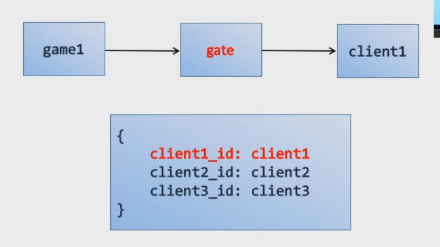
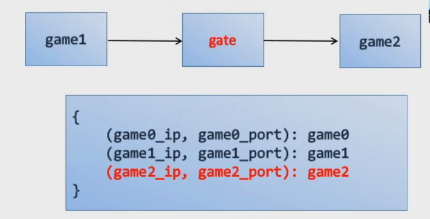
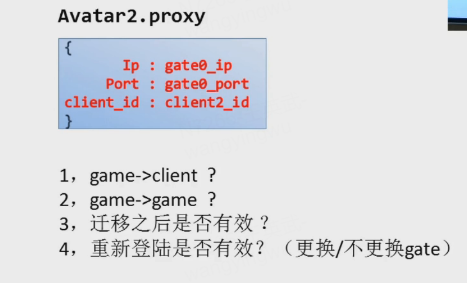
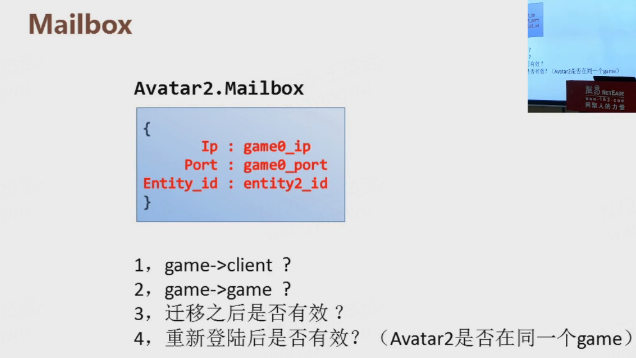

## **Gate的作用：** ##

- 分担部分耗时操作（压缩\解压，加密\解密）
- 隔离外网访问，增加数据安全性
- 迁移方便，只需更新一次hash条目
- **缺点：**增加一定ping值，可忽略

## **Mailbox：** ##

- **Client到GameServer**： 先经由Gate，Gate根据client_id（客户端唯一标识，客户端连接服务端前都会先生成一个唯一id）去查找玩家在哪个Game上，然后转发到这个Game。在客户端在第一次连接Gate的时候服务器会分配一个Game（随机分配和负载均衡两种策略），并将映射关系保存到Gate
 

- **GameServer到Client**：先经由Gate，Gate根据client_id（客户端唯一标识，客户端连接服务端前都会先生成一个唯一id）转发到玩家的客户端

- **GameServer到GameServer**：先经由Gate，Gate根据目标GameServer的Mailbox（由ip和port组成）检索到目标GameServer并转发过去，Gate上GameServer的映射表在GameServer启动的时候会去Gate注册映射关系

 

- **Proxy数据结构**:

1. 可以，Gate可以根据client_id去映射表找到对应的Client
2. 可以，Gate可以根据client_id去映射表找到对应的Game
3. 有效，迁移会更新Gate上client_id到Game的映射表，Gate根据proxy的client_id仍可以找到迁移后的Game
4. 分情况，如果换Gate则proxy里面的ip和port将失效，若未换Gate（顶号），则proxy仍然有效

 

- **Mailbox数据结构**:
 

1. 不可以，不知道client_id，找不到client
2. 可以，选择任意一个Gate即可根据ip和port去映射表找到Game从而转发过去。但实际上不能是在Mailbox构造完成时即选定一个Gate，此后所有的rpc都经由该Gate转发，这样可以保证rpc的有序性
3. 无效，Entity迁移后原mailbox的ip和port已经失效
4. 分情况，如果是服务端下线后再上线，重现load的entity不一定还是在原来的Game上，所以旧的mailbox会失效

**总结：** Proxy适用于需要迁移，client和server都需要调用rpc的Avatar对象，Mailbox适用于不需要迁移的Entity如Npc，Monster， Stub

 
## **属性同步：** ##

两种数据结构CustomMapType和CustomListType，分别对应dict和list。 CustomMapType == dict + auto-sync, CustomListType = list + auto-sync。 三种同步类型：OWN\_CLIENT只同步给自己客户端、ALL\_CLIENTS同步给aoi所有客户端、SERVER\_ONLY不同步给客户端；
属性变化时，会生成一个area\_prop\_notify的同步消息，数据结构如下：

    area_prop_notify {
		'Notify_type': xxx,
		'Value': xxx,
		'Path': xxx
	}

其中Path格式为根节点到属性叶节点以成员访问符号.串起来的字符串，如：school.classA.number。 生成同步消息后会将消息插入到当前主线程的merge_notify的队列，然后在后续的某个时间点会从将当前线程的队列flush到Work线程并打包和序列化，最后通过Gate转发给客户端。

- **Avatar1进入到Avatar2的aoi同步过程：** 
	1. Avatar1的所有public属性打包一份发送给Avatar2的client2
	2. 在client2创建Avatar1，使用打包数据初始化
	3. area\_prop\_notify命令方式差量同步
	
**public属性怎么拿？**

- python主线程对象上获取： 由于进出aoi会很频繁，大量序列化会卡主线程cpu
- work线程：首次同步时，主线程会将所有public属性打包flush到work线程，work线程生成对象的Shadow_Map，后续属性更新会更新Shadow_Map，因此可以从work线程的Shadow_Map拿public属性

**flush何时触发？**

- 每帧flush： 固定帧率延时
- 每当属性修改flush：task会很多很零碎，影响性能
- 一次脚本callback回调flush：包括rpc、timer、db，折衷方案，效果最好