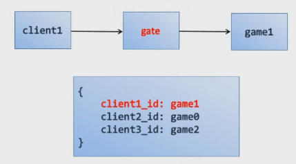
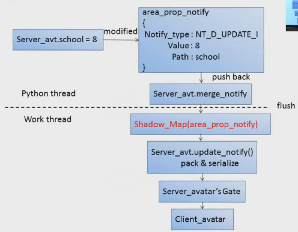

## **Messiah Server架构：** ##
 

 

**线程模型：**

- 主线程（python线程）
- Worker线程（可有多个，asiocore.set\_thread\_num设置）

**python回调方式：**

1. 抢占GIL：tcp连接\断开使用抢占GIL方式，若使用回调队列可能会出现这样一种情况，连接后又马上断开，主线程从队列取出连接成功的回调时其实已经断开了，这就造成不一致的问题。引擎抢GIL回调的方式可以保证引擎在需要回调时会立马执行从而保证状态一致。但会导致python线程在执行函数时会发生切换。
2. 回调队列：Worker线程执行完后把需要执行的回调放到队列去，主线程从队列取出回调然后执行。

**基本实体：**

- ServerEntity：服务端对象父类，支持rpc、db等操作
- ServerAreaEntity(ServerEntity)：AOI支持
- AvatarEntity(ServerEntity)：玩家控制的实体（with client）
- AvatarAreaEntity(ServerAreaEntity, AvatarEntity)
- ServerStubEntity(ServerEntity)：全球单点服务，以名字唯一标识

**开服流程：**

1. 所有进程启动（Gate、Game、GameManager、DBManager）
2. 各个进程向GameManager注册
3. GameManager向所有Game和Gate广播Game列表
4. Gate连接所有Game
5. Gate连接成功，执行开服逻辑
6. Game和Gate向GameManager报告完成
7. 所有进程完成初始化，选取Primary Game
8. Primary创建所有ServerStubEntity
9. GameManager判断所有stub创建完成，通知Gate允许登录

## **Gate的作用：** ##

- 分担部分耗时操作（压缩\解压，加密\解密）
- 隔离外网访问，增加数据安全性
- 迁移方便，只需更新一次hash条目
- **缺点：**增加一定ping值，可忽略

## **Mailbox：** ##

- **Client到GameServer**： 先经由Gate，Gate根据client_id（客户端唯一标识，客户端连接服务端前都会先生成一个唯一id）去查找玩家在哪个Game上，然后转发到这个Game。在客户端在第一次连接Gate的时候服务器会分配一个Game（随机分配和负载均衡两种策略），并将映射关系保存到Gate
 

- **GameServer到Client**：先经由Gate，Gate根据client_id（客户端唯一标识，客户端连接服务端前都会先生成一个唯一id）转发到玩家的客户端

- **GameServer到GameServer**：先经由Gate，Gate根据目标GameServer的Mailbox（由ip和port组成）检索到目标GameServer并转发过去，Gate上GameServer的映射表在GameServer启动的时候会去Gate注册映射关系

 

- **Proxy数据结构**:

1. 可以，Gate可以根据client_id去映射表找到对应的Client
2. 可以，Gate可以根据client_id去映射表找到对应的Game
3. 有效，迁移会更新Gate上client_id到Game的映射表，Gate根据proxy的client_id仍可以找到迁移后的Game
4. 分情况，如果换Gate则proxy里面的ip和port将失效，若未换Gate（顶号），则proxy仍然有效

 

- **Mailbox数据结构**:
 

1. 不可以，不知道client_id，找不到client
2. 可以，选择任意一个Gate即可根据ip和port去映射表找到Game从而转发过去。但实际上不能是在Mailbox构造完成时即选定一个Gate，此后所有的rpc都经由该Gate转发，这样可以保证rpc的有序性
3. 无效，Entity迁移后原mailbox的ip和port已经失效
4. 分情况，如果是服务端下线后再上线，重现load的entity不一定还是在原来的Game上，所以旧的mailbox会失效

**总结：** Proxy适用于需要迁移，client和server都需要调用rpc的Avatar对象，Mailbox适用于不需要迁移的Entity如Npc，Monster， Stub

- **Entity迁移：**

1.迁移前先在目标game上创建PreTransferEntity

2.告知gate缓存客户端发来的消息

3.在旧game创建PostTransferEntity负责缓存其他服务端进程发来的消息

4.目标game上创建real_entity。

5.gate连接到迁移后的game

6.转发缓存的消息到迁移后的game

PreTransferEntity：迁移前在目标game创建，用来做一些迁移前的检测工作。

PostTransferEntity：迁移时在源game进程创建，因为迁移过程中还会有其他进程发来消息，它就负责缓存这些消息，等迁移成功后再转发出去

 
## **属性同步：** ##

两种数据结构CustomMapType和CustomListType，分别对应dict和list。 CustomMapType == dict + auto-sync, CustomListType = list + auto-sync。 三种同步类型：OWN\_CLIENT只同步给自己客户端、ALL\_CLIENTS同步给aoi所有客户端、SERVER\_ONLY不同步给客户端；
属性变化时，会生成一个area\_prop\_notify的同步消息，数据结构如下：

    area_prop_notify {
		'Notify_type': xxx,
		'Value': xxx,
		'Path': xxx
	}

其中Path格式为根节点到属性叶节点以成员访问符号.串起来的字符串，如：school.classA.number。 生成同步消息后会将消息插入到当前主线程的merge_notify的队列，然后在后续的某个时间点会从将当前线程的队列flush到Work线程并打包和序列化，最后通过Gate转发给客户端。

- **Avatar1进入到Avatar2的aoi同步过程：** 
	1. Avatar1的所有public属性打包一份发送给Avatar2的client2
	2. 在client2创建Avatar1，使用打包数据初始化
	3. area\_prop\_notify命令方式差量同步
	
**public属性怎么拿？**

- python主线程对象上获取： 由于进出aoi会很频繁，大量序列化会卡主线程cpu
- work线程：首次同步时，主线程会将所有public属性打包flush到work线程，work线程生成对象的Shadow_Map，后续属性更新会更新Shadow_Map，因此可以从work线程的Shadow_Map拿public属性

**flush何时触发？**

- 每帧flush： 固定帧率延时
- 每当属性修改flush：task会很多很零碎，影响性能
- 一次脚本callback回调flush：包括rpc、timer、db，折衷方案，效果最好

**position如何同步？**

- avatar1的position发生变化，会将变化后的position放到aoi对象里其他avatar的同步消息队列去，相当于将aoi范围内的玩家坐标打包同步到客户端，以减少rpc次数

 
## **高级特性：** ##

**位移检查**

因为服务端是没有客户端的完整物理信息，且客户端到服务端通信会有延迟，不可能做到服务端每帧计算位移。 因此只能由客户端计算每帧位移然后服务端按一定阈值去校验。

1. 帧间移动速度检查： 避免不了客户端加快帧率的情况，每帧都没超速但可以提高帧率
2. 帧率检查：解决了上面的问题，考虑到存在网络抖动的情况，阈值要稍微放宽
3. 平均移动速度检查：由于存在网络抖动，可以允许某一帧速度超限，但平均速度不能超
4. 平均垂直速度检查：同上

**负载均衡：**

1. Gate： Client在连接Gate时随机选择一个
2. Game：Gate配置负载均衡算法，按负载策略选择Game创建Avatar实例，也可以手动设置Game不让在它上面创建Avatar实例
影响因素： CPU、内存、硬件配置、进程响应速度、玩法（如晚上8点有丧尸围城玩法）

**寻路系统：**

Recast算法，基于mesh的寻路算法

- 非线程安全
- 异步调用
- 无锁

**RPC Index：**

使用Perfect-ish Hash算法将rpc name映射成一个4位数字，离线计算

**KCP协议：** 基于UDP改造，冗余发包，在弱网环境下比TCP有更好的效果

**KSM：** Kernel Samepage Merging，节约内存

**内存管理：**

1. KSM：Kernel Samepage Merging，合并内存页节约内存
2. MCache：free时不直接释放内存，而是放在内存池，下次使用先从内存池取出空闲内存区，减少内存分配带来的CPU消耗
3. Message Queue： 内存池满的情况下销毁对象并不直接有python主线程直接销毁，而是push到MessageQueue分摊到各Worker线程，从而减少主线程的卡顿